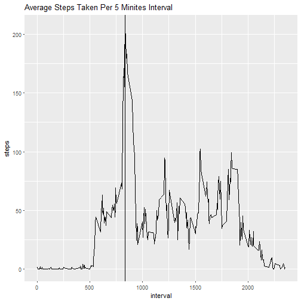
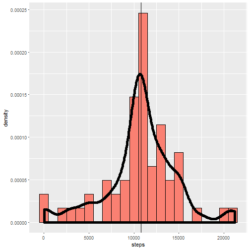
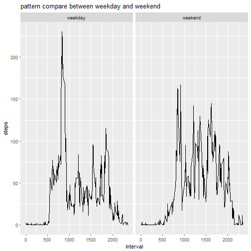

```r
knitr::opts_chunk$set(echo = TRUE,results="hide",message=FALSE,warning=FALSE)
```

## Introduction 

It is now possible to collect a large amount of data about personal movement using activity monitoring devices such as a Fitbit, Nike Fuelband, or Jawbone Up. These type of devices are part of the "quantified self" movement -- a group of enthusiasts who take measurements about themselves regularly to improve their health, to find patterns in their behavior, or because they are tech geeks. But these data remain under-utilized both because the raw data are hard to obtain and there is a lack of statistical methods and software for processing and interpreting the data.

This assignment makes use of data from a personal activity monitoring device. This device collects data at 5 minute intervals through out the day. The data consists of two months of data from an anonymous individual collected during the months of October and November, 2012 and include the number of steps taken in 5 minute intervals each day.


## What is mean total number of steps taken per day?


```r
library(dplyr)

##Reading data from csv file
originaldata = read.csv("activity/activity.csv",na.strings="NA",header=TRUE,colClasses = c("integer","character","integer"))
##Transform the date to actual Date type
originaldata =transform(originaldata,date=as.Date(as.character(date)))

# 
# object.size(originaldata)
# sapply(originaldata,typeof)
# head(originaldata)


library(dplyr)

##summarise daily steps taken and ignore the NAs
dailysteps = originaldata %>% group_by(date)%>%summarise(steps=sum(steps,na.rm=TRUE))


library(ggplot2)

## calculate mean and median
mu1 = mean(dailysteps$steps)
mid1 = median(dailysteps$steps)

## get histogram
g <- ggplot(dailysteps,aes(x=steps))
g <- g + geom_histogram(fill="salmon",binwidth=1000,colour="black",aes(y = ..density..))
g <- g + geom_density(size = 2)
g <- g + geom_vline(xintercept = mu1)
g <- g + geom_vline(xintercept = mid1)
g <- g + labs(title = "Steps Taken Per Day")
g
```


We know from histogram that on the average , the man walks 9354.2295082 steps per day and the median of the total steps taken per day is 10395

## What is the average daily activity pattern?


```r
## sum up steps accross days for each interval  
intervals = originaldata %>% group_by(interval)%>%summarise(steps=mean(steps,na.rm=TRUE))

## find out the max steps interval
maxinterval = intervals[which.max(intervals$steps),1][[1]]

g <- ggplot(intervals,aes(x=interval,y=steps))
g <- g + geom_line()
g <- g + geom_vline(xintercept = maxinterval)
g <- g + labs(title = "Average Steps Taken Per 5 Minites Interval")
g
```



The 835 interval , on average across all the days in the dataset, contains the maximum number of stpes

## Imputing missing values

In this sector, I  use the mean steps of that interval across days to fill NA


```r
intervals = originaldata %>% group_by(interval)%>%summarise(interval_average=mean(steps,na.rm=TRUE))
## add a column fill with the average steps of the interval across days 
activity =merge(originaldata,intervals,by="interval",all=FALSE)
## fill the NAs
head(activity)
activity[!complete.cases(activity),"steps"] = activity[!complete.cases(activity),"interval_average"]

## we can actually see the NAs are all gone
# sum(complete.cases(activity))
# mean(complete.cases(activity))


##recalculate the daily step as before in question 1
dailysteps = activity %>% group_by(date)%>%summarise(steps = sum(steps,na.rm=TRUE))
mu = mean(dailysteps$steps)
mid = median(dailysteps$steps)

g <- ggplot(dailysteps,aes(x=steps))
g <- g+geom_histogram(fill="salmon",binwidth = 1000,colour="black",aes(y=..density..))
g <- g+geom_density(size=2)
g <- g+geom_vline(xintercept = mu)
g <- g+geom_vline(xintercept=mid)
g
```



After imputing missing values, we can see steps with higher value get higher frequency than befor, that makes sense since the zero ones are now moving into higher value sectors.In method I chose, results average number and median number of the stpes taken per day be the same , both are 10766.19.And they are reasonably higher than the value before we impute :9354.2295082 and  10395   


## Are there differences in activity patterns between weekdays and weekends?


```r
activity = activity[,0:3]

## add a column with weekday for the date
activity["weekday"] = lapply(activity["date"],function(x){
        
 c("weekend", "weekday", "weekday", "weekday", "weekday", "weekday", "weekend")[as.POSIXlt(x)$wday + 1]
        
        })

## calculate steps by interval for each weekday
intervalbyday = activity %>% group_by(weekday,interval)%>%summarise(steps = mean(steps))
intervalbyday = transform(intervalbyday,weekday=factor(weekday,levels=c("weekday", "weekend")))


g <- ggplot(intervalbyday,aes(x=interval,y=steps))
g <- g + facet_wrap(~weekday)
g <- g + geom_line(colour="black")
g <- g + labs(title="pattern compare between weekday and weekend")
g
```



There is a very significant difference between weekdays and weekend , which in weekday there is a very high peek in 835th interval
